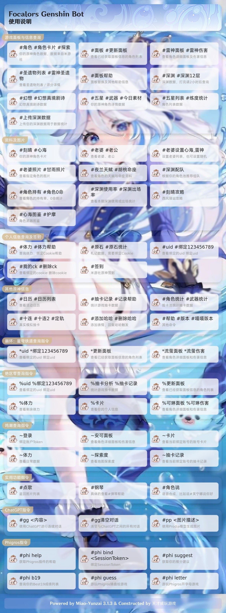
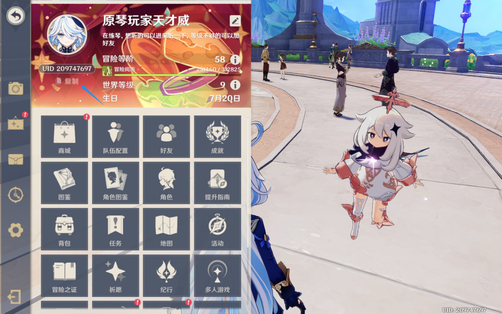
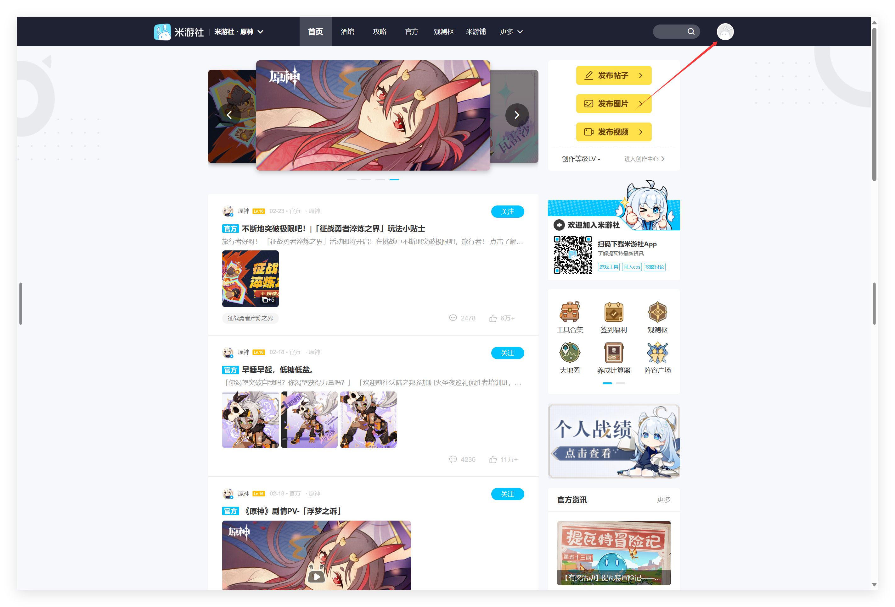
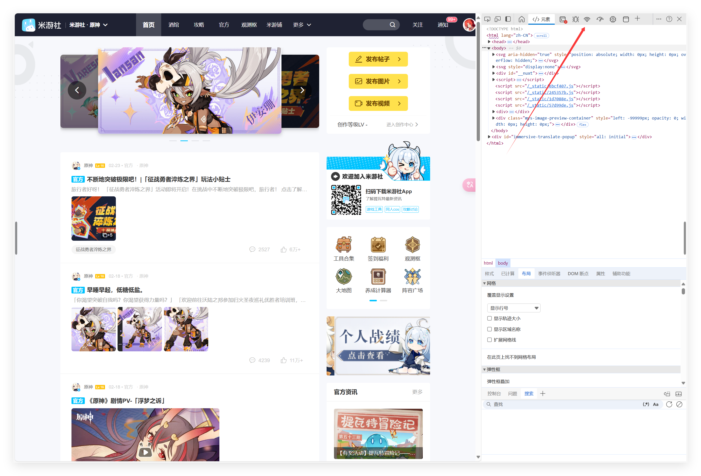
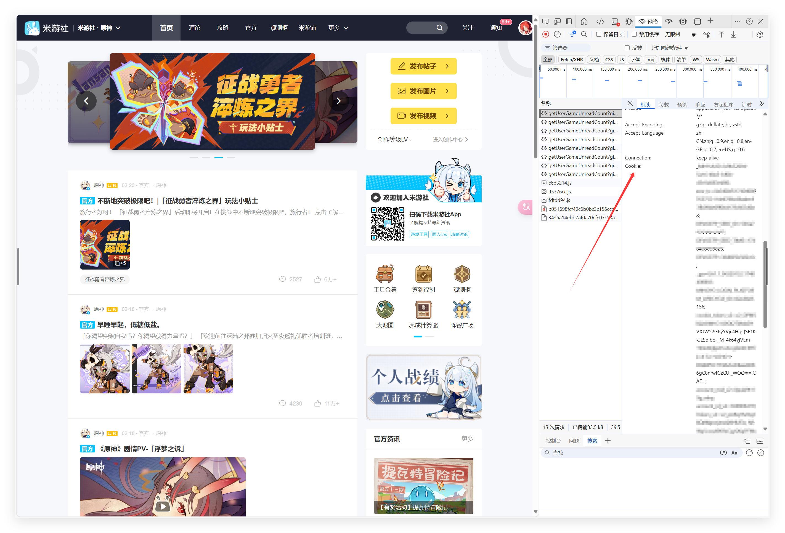

## 功能列表

---
## 原神/崩坏：星穹铁道面板查询

> 该面板查询功能由喵喵插件提供

### 绑定游戏
##### 通过游戏UID进行绑定（这里以《原神》为例）

1. 启动游戏
2. 打开派蒙菜单
3. 在派蒙菜单中找到您的UID并复制

4. 回到QQ群聊中，发送`#绑定+您的UID`进行账号绑定
5. 发送`#更新面板`来对游戏面板进行更新

##### 通过米游社的Cookie进行绑定（同时绑定米游社所关联的所有游戏）

**PC网页端绑定方法**
1. 打开浏览器并输入网址：[www.miyoushe.com/ys](https://www.miyoushe.com/ys)
2. 点击右上角头像登录

3. 按下F12快捷键调出开发人员工具
4. 点击“网络”选项卡

5. 点击以“getUser”开头的文件

6. 向下滑动鼠标并找到“Cookie”选项并复制右边的内容

7. 将复制的内容**私信**发送给机器人
8. 发送`#更新面板`来对游戏面板进行更新

**移动端绑定方法（扫码登录）**
1. 发送`#扫码登录`获取米游社的登录二维码
2. 使用米游社进行扫描并授权登录
3. 发送`#更新面板`来对游戏面板进行更新

> 注意：我们不会保存和使用您的Cookie和Stoken，请放心绑定

## 绝区零面板查询

> 该面板查询功能由绝区零插件提供

### 绑定游戏

- 由于目前暂无API可以用来查询绝区零的游戏数据，因此绝区零的游戏数据仅支持使用Cookie或Stoken绑定并查询
[点击查看绑定米游社Cookie的教程](#通过米游社的Cookie进行绑定（同时绑定米游社所关联的所有游戏）)
## Phigros游戏信息查询
### 帮助获取

- 发送`#phi help`来获取有关该功能的帮助
### 绑定SessionToken方法
##### 直接绑定

1. 下载MT管理器并打开（Android 12及以上的系统需提前授予Shell或Root权限）
2. 打开`/storage/emulated/0/Android/data/com.PigeonGames.Phigros/.userdata`文件
3. 找到“sessionToken”后面的那一串不规则的代码并将其复制
4. **私信**机器人并发送`#phi bind+您复制的SessionToken`进行绑定，绑定之后机器人会自动更新游戏面板
5. 若您需要手动更新面板，请使用`#phi update`进行游戏数据的更新
##### 通过TapTap扫码登录进行绑定

1. 发送`#phi bind qrcode`获取TapTap的登录二维码
2. 使用Phigros绑定的TapTap账号进行扫码登录
3. 扫码并授权登录之后会自动绑定SessionToken，绑定之后机器人会自动更新游戏面板
### 游玩信息获取方法
##### BestN成绩图片

- 发送`#phi bN`来获取您的BestN成绩图片（这里的N为成绩图中所包含的曲目数量，最大为50）
##### 推分建议

- 发送`#phi suggest`来获取您的推分建议
### 游戏内容查询
##### 曲目信息

- 发送`#phi song+曲目名称`来获取有关该曲目的信息（支持使用别名进行查询）
### 小游戏
##### 开字母

- 发送`#phi letter`来游玩开字母游戏
##### 猜曲绘

- 发送`#phi guess`来游玩猜曲绘游戏
---
## 实用功能
### 点歌

- 输入`#点歌+歌名`进行点歌

> **注意**：该插件默认只会点网易云音乐的歌，若您需要点其他平台的歌，请在`#点歌`后面加上对应的平台，例如`#点歌酷狗`，`#点歌qq`等（目前仅支持这三个平台，且QQ音乐的指令需要全部都为小写字母才能被正确识别

### 弹琴

> 输入`#弹琴帮助`来获取有关机器人的弹琴功能的帮助

- **指令**：`#+乐器名称+音调+|+速度`
- **举例**：#钢琴 123150032050201-63001-7|240

> **注意**：空拍需要以`0`作为填充符，“|”后面的数字通常为这首歌的BPM进行相应的计算后得出的结果，具体可参照下面的表格

| 一个数字所代表的音符 | “\|”后面的数字 |
| ---------- | --------- |
| 全音符        | BPM×0.25  |
| 二分音符       | BPM×0.5   |
| 四分音符       | BPM×1     |
| 八分音符       | BPM×2     |
| 十六分音符      | BPM×4     |
